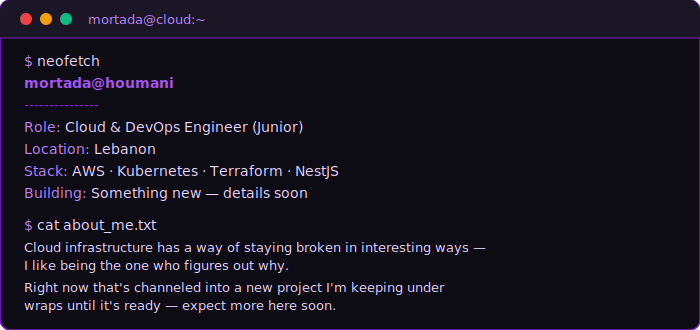
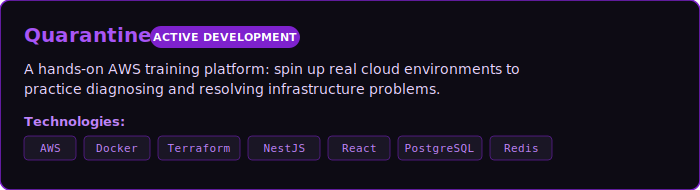

<!-- Dark Purple GitHub Profile README — Mortada Houmani -->
<!-- Palette: #A855F7 (Primary Purple), #7E22CE (Deep Purple), #0D0B14 (Near-Black Purple-Slate) -->

  

  

---

  

---

## Current Focus

  

---

## Tech Stack

<table width="100%">
  <tr>
    <td valign="top" width="50%">
      <h3>Cloud & DevOps</h3>
      
    </td>
    <td valign="top" width="50%">
      <h3>Backend</h3>
      
    </td>
  </tr>
  <tr>
    <td valign="top" width="50%">
      <h3>Frontend</h3>
      
    </td>
    <td valign="top" width="50%">
      <h3>Tools</h3>
      
    </td>
  </tr>
</table>

---

## GitHub Analytics

  <table border="0" style="border-collapse: collapse; border: none;">
    <tr style="background: none; border: none;">
      <td colspan="2" align="center" style="border: none; background: none; padding: 10px;">
        
      </td>
    </tr>
  </table>

---

## Connect with Me

  
  &nbsp;&nbsp;
  

---

  

